```{r setup, include=FALSE}
knitr::opts_chunk$set(echo = FALSE)
#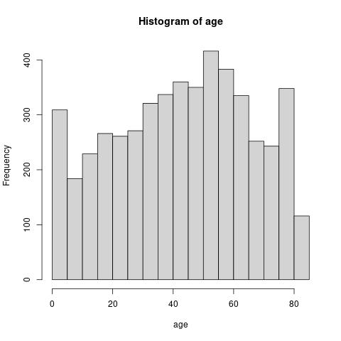

library(tidyverse)
#library(reticulate)
library(tidyr)
#library(matlab)
library(MASS)
library(stats)
# library(nlme)
library(tibble)
library(dplyr)
library(data.table)
# library(assist)
library(mgcv)
library(ggplot2)
# library(lme4)
#library(kernlab)
#library(plotly)
# library(numDeriv)
# library(randtoolbox)
# library(mrgsolve)
# library(parallel)
# library(BSDA)
# library(epitools)
#library(rdist)
#library(gbm)
library(Rtsne)
library(glmnet)
library(gbm)
library(plotly)

data = read.csv("brain_stroke.csv")
attach(data)
```


# Abstract

The goal of this document is to study how certain covariates in the Brain Stroke Dataset depend on eachother. The covariates included in the data set are gender, age, hypertension, heart disease, worktype, average glucose level, bmi, smoking status, and stroke. Previous literature suggest that heart disease, high blood pressure, diabetes, cholesterol levels, smoking status, age, and sex are risk factors. We would like to study if these risk factors, as well as the other covariates, are determine stroke in this data set. In this examination, we determine the most likely risk factors in this dataset and reveal a number of interesting interactions between covariates. We also build a model purely for prediction accuracy, and test the reliability of the data with a cross validation.


# Introduction

A stroke is a medical condition in which poor blood flow in the brain causes brain cell deaths. Strokes can be caused either by bleeding in the brain, which is classified as a hemorrhagic stroke, or by a lack of blood flow to the brain, which is classified as an ischemic stroke. Medical literature attributes many causes for a stroke: high blood pressure, cholesterol levels, and cardiovascular diseases can increase the risk of a stroke, most often by causing blood clots that may dislodge and then block blood vessels. Other conditions, such as diabetes, smoking, aneurysms, inflammation, and comorbidities may increase either the risk of having a stroke or the severity of it.

In this dataset is recorded several covariates:

Our main goal will be to correlate stroke with the other variables to asses them as risk factors.

1) gender: "Male", "Female" or "Other"

2) age: age of the patient

3) hypertension: 0 if the patient doesn't have hypertension, 1 if the patient has hypertension

4) heart disease: 0 if the patient doesn't have any heart diseases, 1 if the patient has a heart disease 

5) ever-married: "No" or "Yes"

6) worktype: "children", "Govtjov", "Neverworked", "Private" or "Self-employed" 

7) Residencetype: "Rural" or "Urban"

8) avgglucoselevel: average glucose level in blood

9) bmi: body mass index

10) smoking_status: "formerly smoked", "never smoked", "smokes" or "Unknown"*

11) stroke: 1 if the patient had a stroke or 0 if not


The presence of many categorical and continuous covariates poses a challenge, and we will make a note to be wary of confounders and paradoxes, such as we will soon find in the relationship between Stroke, Age, and BMI. We will investigate such interactions with models and plots.


# Exploration

## First steps

The first step to understanding a (small enough) dataset is to view the covariates individually. With some quick summary statistics, we can get an idea of what we are looking at:

```{r first summary, include=FALSE}
summary(data)
```

As expected, the value of stroke is either 0 or 1. Age, somewhat surprisingly, varies all the way from 0.08 to 82. It is clear from the dataset the low ages are not misinputs, so we may assume that our study includes data about very young patients. BMI varies from 14 to 48, reasonable values for a human dataset. We may also see that there are a large amount of unknown smoking statuses (about 1/3ish of the patients), both heart disease and hypertension have relatively low occurence (less than 10%), most patients were married, and there are more female patients than male. Literature suggests that stroke is more likely in young male patients, but the longer life expectancy of female subjects creates a survival bias that inflates the prevalence among older female patients. It remains to be seen if this is observered in our dataset. Furthermore, the ages are roughly evenly distributed, with no especially large tendency towards young or old. 


It was not mentioned how average blood glucose levels were measured, but it is most likely with an A1c screening. Thus, we might try to use average blood glucose levels as a stand in for diabetes. We may use average blood glucose as a continuous covariate to preserve accuracy, or we may attempt to stratify into normal (<117 mg/dL), prediabetic (117-137 mg/dl), and diabetic (>137 mg/dL) for ease of interpretation. 


## Some plots

Now that we've gotten our bearings a little, we can ask the plots for the simplest questions. Firstly, how does stroke risk vary with our continuous covariates?

```{r some plots and models}
fitage = glm(stroke ~ age, family = binomial, data = data)
smm = summary(fitage)
smm$coefficients
```
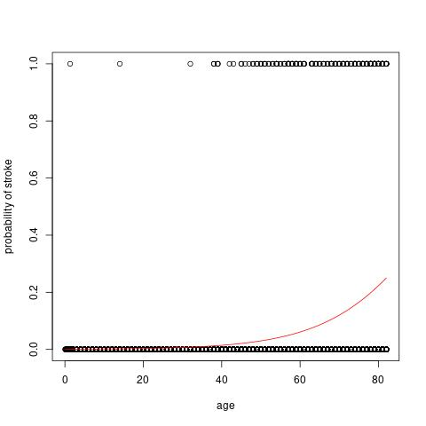


In the above plot (code can be found in the EDAvisual.R file), we plot the occurrences of stroke/no stroke against age. Overlaid in a red line is a glm, fitting risk of stroke against age. The glm estimates an 0.075 increase in odds per year increase in age. Furthermore, the null over residual deviance suggests that the fit is relatively appropriate, and we do not worry yet about zero inflations or other potential issues quite yet. First, we investigate the other bivariate cases to satisfy our intuition.


Since we have observed that age increases risk, what about BMI?
```{r bmi}
fitage = glm(stroke ~ bmi, family = binomial, data = data)
summary(fitage)$coefficients
```
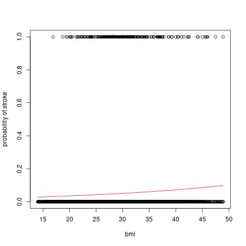


In the above plot, we now see that BMI is associated with an increasing risk of stroke. Furthermore, we will a similar association in average blood glucose levels below:

```{r average glucose}
fitage = glm(stroke ~ avg_glucose_level, family = binomial, data = data)
summary(fitage)$coefficients
```
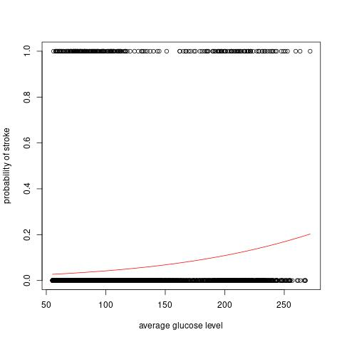


Now we may move on to the categorical covariates: these may be investigated with a table.

```{r boxplots}
tab = data %>% group_by(smoking_status,stroke) %>% tally()
s = tab %>% filter(stroke == 1)
ns = tab %>% filter(stroke == 0)
# 
# s
# ns
props = s$n/(s$n+ns$n)
# barplot(s$n/(s$n+ns$n)~s$smoking_status)
# barplot(s$n~s$smoking_status)
```
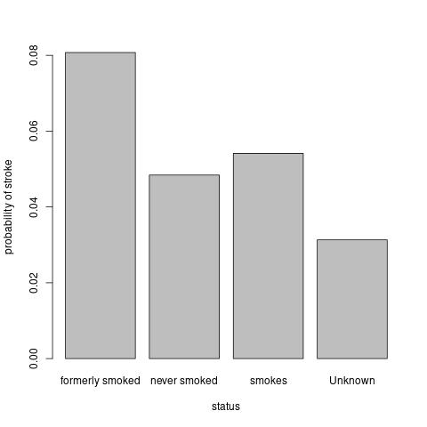


What a strange trend! The prevalence of stroke among never smoked and smokes is similar, while the prevalence in former smokers is much higher! It is biologically unlikely that smoking then stopping has a special ability to prevent strokes. It is more likely that there is some kind of multiple dependence or sample bias: maybe those who formerly smoked stopped because they experienced a health complication, or those who had the time to smoke then stop tended to be older. There is no clear way to interpret such bias without sampling more data, so we are stuck with only speculation.


Moving on, we may next take a look at hypertension and heart disease. Since both of these are strongly medically related, I will plot them with interaction. 

```{r hypertension and heart disease}
fit = glm(stroke ~ -1+I((!hypertension)*(!heart_disease))+I(hypertension*(!heart_disease))+I((!hypertension)*(heart_disease))+I(hypertension*heart_disease), family = binomial, data = data)
summary(fit)$coefficients
fit = glm(heart_disease~hypertension, family = binomial, data = data)
summary(fit)$coefficients

```
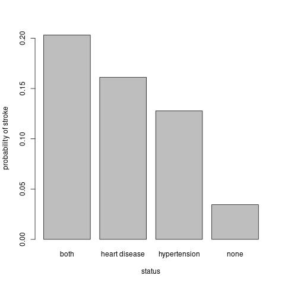


From the bar plot, we can see that those with both heart disease and hypertension have the most risk. Then, in descending order, heart disease only, hypertension only, and none. The model is kind enough to tell us that these differences are significant. We can also use a simple glm to determine that those with hypertension have a significantly higher risk of also having heart disease, indicating that these two covariates are indeed related.


Now that we have some intuition about what to expect, we can move on to all the covariates in one model.

```{r gender}
fit = glm(stroke ~ ., family = binomial, data = data)
summary(fit)$coefficients
```


In our model, we have some surprising results: gender, heart disease, smoking status, and bmi are no longer significant! This may be due to some form of multicollinearity between it and the significant variables, but we would suspect these covariates to be significant regardless of multiple dependence. Gender, for example, is suggested to be a significant risk factor, but only depending on age. Smoking status was also supposed to be a risk factor, and intuitively should not be completely dependent on the others as we do not have a variable for lung disease.
We also tried multiple variable selection techniques, such as forwards/backwards/bidirectional stepwise selection and LASSO. These did not yield any further insight, and they will be relegated to the EDA.r file. So, lets investigate further.

Our next model will be a generalized additive model. This type of model allows for easy semiparametric multivariate modelling because of the additive treatment of the multiple dimensions univariately as well as capability for multivariate smoothing, such as with tensor product splines. We can then test for nonlinear relationships and for interactions. First, we establish a base model with only the significant covariates from the full model as well as BMI, which we suspect to be relevant:


```{r gam base}
fit = glm(stroke ~ age+hypertension+avg_glucose_level+bmi, family = binomial, data = data)
summary(fit)$coefficients
```

## A side-note about semi-parametric generalized additive models:

In case you're not familiar with the tensor product splines and the SS-ANOVA in spline models, special multivariate models called "tensor product splines" can be constructed from the Reproducing Kernel Hilbert Space point of view. The details are beyond the scope of this report, but the punchline is that the model space can be broken up into a collection of orthogonal subspaces. The fact that these subspaces are orthogonal allows for an ANOVA based on a sort of decomposition of deviances explained, so that smooth terms in the model can be "significance tested." The unpenalized subspace, or the parametric part, is allowed to vary completely freely to minimize the objective function. In practice, these are usually very rigid and interpretable subspaces, such as the subspace of linear models. The non-parametric part, or smooth term, is a shape-fitting regression that can adjust to any shape, but is prevented from overfitting by a penalty functional. The classical non-parametric regression is the cubic smoothing spline. Popular nowadays are Gaussian Process Regressions and Regression Splines. The splines implemented by the MGCV package are not "true" RKHS regressions, but rather regression splines with automatically chosen knot points. Under nice enough data, these approximate the kernel regressions fitted by smoothing splines with much better computational performance. More complicated smoothing splines, such as arbitrary kernel regressions or semiparametric mixed effect models, would be better fit by a package like GSS or ASSIST.


## Back to the GAM

When we fit the GAM below, we include the following things: linear terms for age, bmi, hypertension, and average glucose level. Then we include smooth terms for age, bmi, and the interaction between age and bmi. 

```{r gam interactions, echo=FALSE}
fitgam = gam(stroke ~ age+bmi+hypertension+avg_glucose_level+ti(age)+ti(bmi)+ti(age,bmi), family = binomial, data = data)
summary(fitgam)$p.table
summary(fitgam)$s.table
```
To read the above summary, we note that BMI's linear term has become significant and the interaction term "ti(age,bmi)" is significant! This indicates that there is some kind of an interaction between age and bmi in how they predict the risk of stroke. Before we move on, because of the fickle nature of non-parametric models, it is prudent to check with a couple extra models just to be sure it is not a fluke. Below, we fit a bivariate cubic spline, a main-effect adjusted bivariate cubic spline, and a gaussian process smooth.


```{r check if fluke}
fitgam1 = gam(stroke ~ age+bmi+hypertension+avg_glucose_level+s(age,bmi), family = binomial, data = data)
summary(fitgam1)$s.table

fitgam2 = gam(stroke ~ age+bmi+hypertension+avg_glucose_level+ti(age)+ti(bmi)+s(age,bmi), family = binomial, data = data)
summary(fitgam2)$s.table

fitgam3 = gam(stroke ~ age+bmi+hypertension+avg_glucose_level+ti(age)+ti(bmi)+s(age,bmi, bs = "gp"), family = binomial, data = data)
summary(fitgam3)$s.table
```
Because they all report the interaction to be significant, I will include them in our model. We can next investigate how exactly the interaction behaves by plotting a slice of it:


```{r interaction behavior}
grid = data %>% mutate(hypertension = 0, avg_glucose_level = 100)
predicted = fitgam3 %>% predict(grid) %>% as.numeric()
fig = plot_ly(x=age, y=bmi, z= (predicted), type="contour", size = 0.1)
fig
d <- data.frame(x=age,y=bmi,z=(predicted))
plot_ly() %>% 
  add_trace(data = d,  x=d$x, y=d$y, z=d$z, type="mesh3d")
```


It seems from the heatmap and the surface plot that theres a strange interaction. In younger patients, stroke is less likely when BMI is lower. Then, when the patient is old (75 years or older), the risk is lowest when the BMI is between 35 and 45. Some google searches suggest that the medical literature is unsure about the interaction between age, BMI, and stroke. One study https://jamanetwork.com/journals/jamainternalmedicine/fullarticle/754810 suggests that BMI increases stroke risk when age is not adjustested for. Another, https://www.ncbi.nlm.nih.gov/pmc/articles/PMC6719766/, suggests that severity and mortality sigificantly decreases as BMI increases among old patients. This dataset may be a little too small to draw any very meaningful conclusions about the relationship, but it is interesting to see those hypothesis reflected in an "ideal BMI range" of 35-45 in very old patients.


## Building our final model

Now that we've adjusted for the strange interaction between BMI and age, we can investigate if there are any more. Lets check gender:
```{r final model}
fitgam = gam(stroke ~ age+bmi+hypertension+avg_glucose_level+gender+s(I((gender=="Female")*bmi))+s(I((gender=="Female")*age))+s(I((gender=="Female")*avg_glucose_level))+ti(age)+ti(bmi)+ti(age,bmi), family = binomial, data = data)
summary(fitgam)$p.table
summary(fitgam)$s.table

```
There do not seem to be any meaningful interactions between gender and the other continuous variables, but now the linear effect for gender is significant. The ineraction between age and BMI has had its p value reduced, but that is to be expected when we introduce several new degrees of freedom to this kind of model.


While we could investigate the other variables similarly, I will spoil the ending and say that I did not find any other interesting interactions so we can move on to the next part of the investigation.


# Between the Covariates

Now that we looked at how our covariates affect the risk of stroke, we can also see if there are any interesting relationships between the covariates themselves. First, lets look at a t-SNE 

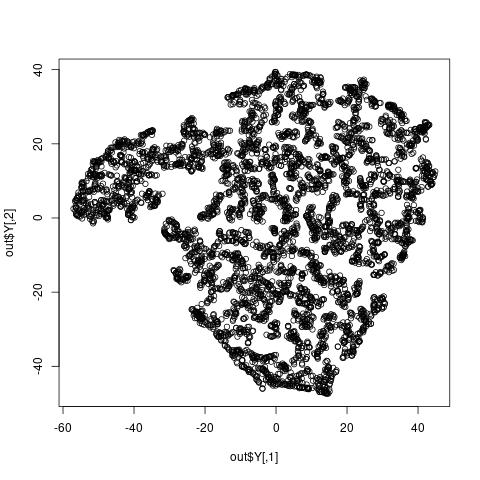

I really do not see anything here. Lets look at te embedding for just the variables age, bmi, smoking_status, gender, hypertension , heart_disease, and avg_glucose_level.

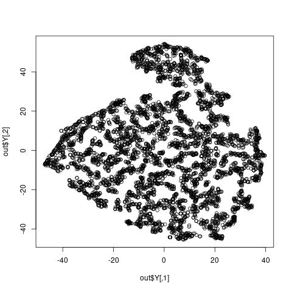


As far as I can tell, there isn't a very easily interpretable clustering structure from the T-SNE. The embedding in the reduced data seems to have some kind of structure, but I do not know how to read it. Maybe we can see a little more if we try a PCA?


```{r PCA}
# pca = prcomp(numdata)
#plot(pca$sdev)
# plot(pca$x[,1]~pca$x[,2])
# plot(pca$x[,2]~pca$x[,3])
# plot(pca$x[,1]~pca$x[,3])
#plot(pca$sdev)
```


There may be some clustering going in the plots of the first component against the second or the second component against the third, but it is not so pronounced. 

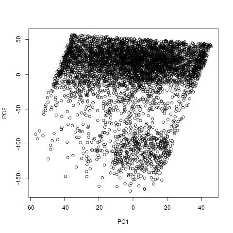

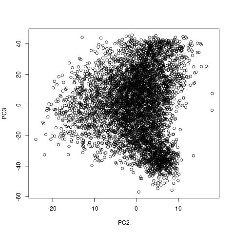
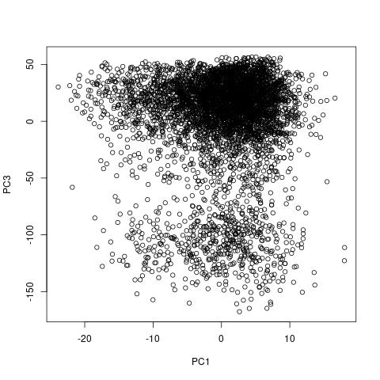

# Big Model
Finally, lets try throwing a more powerful model at the problem and asking what they think. For this, we will use a boosted random forest.


```{r gbm, include=FALSE}
factordata = data %>% mutate(
  smoking_status = as.factor(smoking_status),
  gender = as.factor(gender),
  hypertension = as.factor(hypertension),
  heart_disease = as.factor(heart_disease),
  ever_married= as.factor(ever_married),
  work_type= as.factor(work_type),
  Residence_type= as.factor(Residence_type)
)

#train test split
pstroke = factordata %>% filter(stroke == 1)
nstroke = factordata %>% filter(stroke == 0)

ptrain = sample(nrow(pstroke),nrow(pstroke)/2)
ntrain = sample(nrow(nstroke),nrow(nstroke)/2)

ptest = setdiff(c(1:nrow(pstroke)),ptrain)
ntest = setdiff(c(1:nrow(nstroke)),ntrain)

train = rbind(pstroke[ptrain,],nstroke[ntrain,])
test = rbind(pstroke[ptest,],nstroke[ntest,])

data$gender = as.factor(data$gender)

fit = gbm(stroke ~ .-stroke, distribution = "bernoulli", data = train)
am_prob_pred =predict(fit, newdata=test, type="response")
```

```{r gbm summary}
summary(fit)
```

Interesting! The gbm model mostly agrees with our previous investigation: age and average glucose level are most important, then bmi heart disease and hypertension. However, after running the model several times, sometimes work type is used, and sometimes not. Similar with gender. Now lets see the F1 score and an ROC curve


```{r F1 and ROC helper functions, include = FALSE, echo = FALSE}
threshold = seq(0,1,length.out = 100)
fem = test$stroke
truepositive = function(threshold){
predfem = am_prob_pred > threshold
tpositives = (predfem == 1) & (fem == 1)
return(sum(tpositives)/(sum(fem)))
}
falsepositive = function(threshold){
predfem = am_prob_pred > threshold
fpositives = (predfem == 1) & (fem == 0)
return(sum(fpositives)/(sum(!fem)))
}
truenegative = function(threshold){
predfem = am_prob_pred > threshold
temp = (predfem == 0) & (fem == 0)
return(sum(temp)/(sum(!fem)))
}
falsenegative = function(threshold){
predfem = am_prob_pred > threshold
temp = (predfem == 0) & (fem == 1)
return(sum(temp)/(sum(fem)))
}
tprate = sapply(threshold, truepositive)
fprate = sapply(threshold, falsepositive)
```

```{r ROC plot}
plot(tprate ~ fprate, type = "l", xlab = "False Positive Rate", ylab = "True Positive Rate")
```


```{r F1 prep, include=FALSE}
t = 0.4
precision = truepositive(t)/(truepositive(t)+falsepositive(t))
recall    = truepositive(t)/(truepositive(t)+falsenegative(t))
precision
recall
f1 = (precision*recall)/(precision+recall)
f1
```

```{r F1, include=TRUE}
precision
recall
f1
```

The ROC curve suggests a threshold of about 0.4, which will give us an F1 score of around 0.02, which is far from ideal. The precision tends to be good, its the recall that is very low. Though, because of the low incidence rate, we should expect some degree of zero inflation, so this poor f1 score is not unexpected.


# Conclusion

To wrap up this project, lets summarize what we learned: stroke risk increases with age, cardiovascular disease, hypertension, and average blood glucose levels (diabetes). Risk also depends on BMI, but higher BMI's are riskier in young (<65 year old) patients while there seems to be a lowest risk range from 35-45 BMI in older patients. Gender was marginally significant in our Generalized Additive Model, but only some of the time in the Generalized Boosted Model. Strong associations between covariates were found in the categorical variables, particularly between hypertension and cardiovascular disease, but clustering structure among the continuous covariates were too complicated for my ability to understand. Overall, I think the most interesting find is the complicated interaction between BMI's and age's effect on stroke risk.


